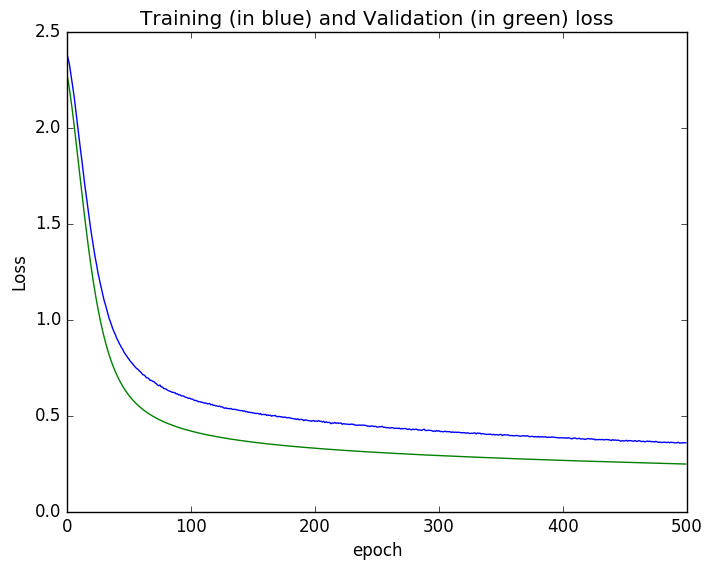

# TwoLayerNNWithLasagne
Simple two layer neural network with Theano and Lasagne to do handwritten digit recognition.

Tried to train a simple 2 layer network with no minibatch. Got around 93% test accuracy after 500 epochs. Will run it longer and update the results as the current results are not very impressive.

Input Layer size: 784 with 20% drop-out and ReLU activation   
Hidden Layer size: 784 x 625 with 50% drop-out with ReLU activation  
Output Layer: 625 x 10 with 50% drop-out with softmax activation  

