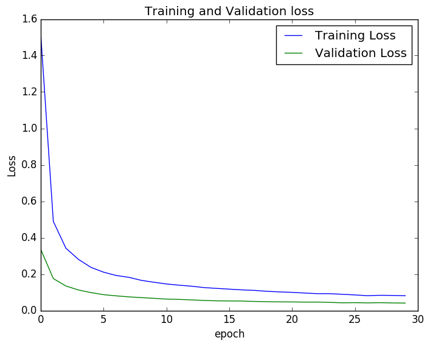
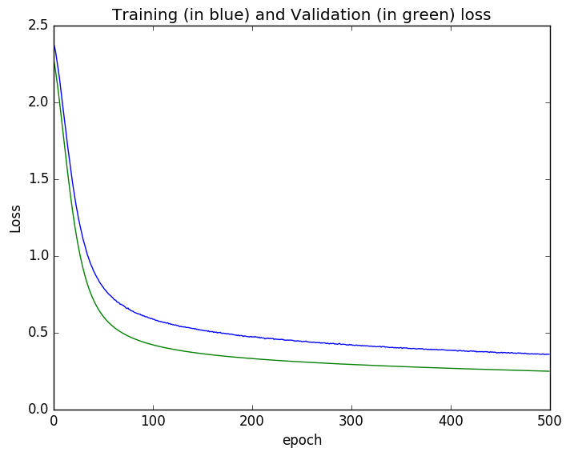
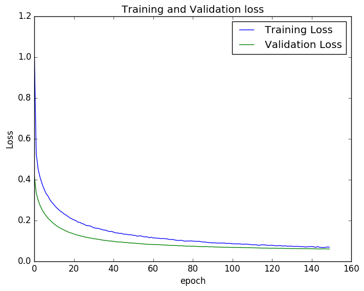

#Neural Network with Theono and Lasagne on MNIST data

####Sample Digits

##Convolutional Neural Network model
Input Layer: 28 x 28  
ConvLayer 1: 32 x 5 x 5  
ConvLayer 2: 32 x 5 x 5  
DenseLayer 1: 256   
DenseLayer 2: 256 * 10  

####Using mini-batch: epoch - 30, test accuracy 99.15%
Each epoch took around 60-90 seconds. The training and validation loss is shown below

##2 Layer Neural Network Model
Input Layer size: 784 with 20% drop-out and ReLU activation   
Hidden Layer size: 784 x 625 with 50% drop-out with ReLU activation  
Output Layer: 625 x 10 with 50% drop-out with softmax activation  

####Without using mini-batch: epoch - 500, test accuracy 93%
Tried to train a simple 2 layer network with no minibatch. Got around 93% test accuracy after 500 epochs. The training and validation loss is shown below      
 
 

####Using mini-batch: epoch - 150, test accuracy 98.15%
Using mini-batch the learning is faster. Each epoch took around 6 seconds. The training and validation loss is shown below

